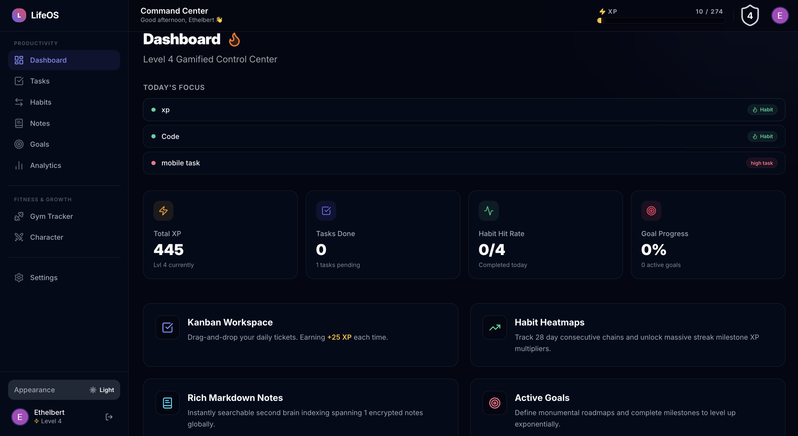
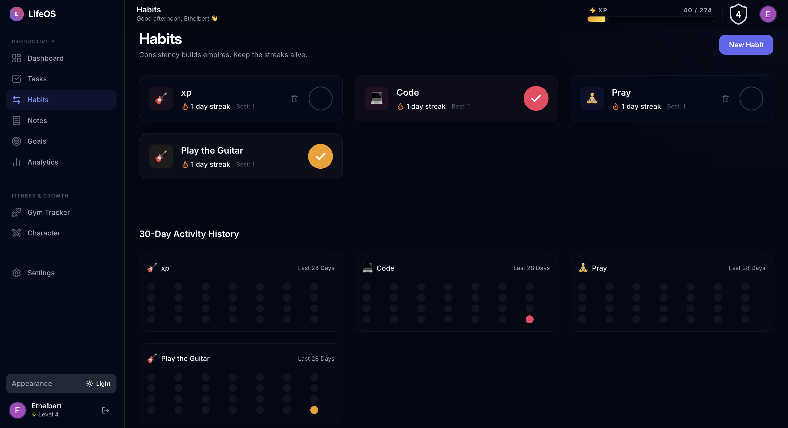
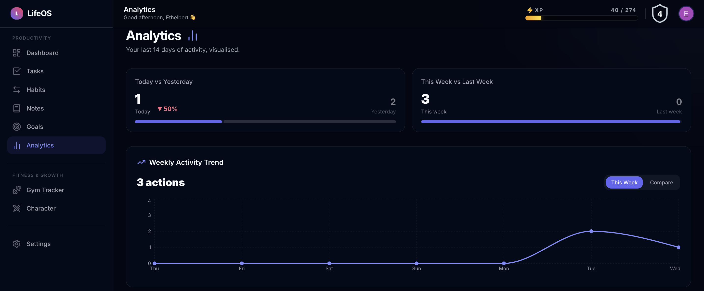

# 🌟 LifeOS – Gamified Productivity Dashboard

LifeOS is an elite, full-stack productivity web application designed to transform your daily routine into a highly engaging, RPG-style experience. Manage tasks, build habits, capture notes, and track long-term goals while earning XP and leveling up.



---

## 🚀 Features

- 🎮 **Gamification Engine:** Earn XP for completing tasks and maintaining habit streaks. Dynamically level up your character based on a mathematically balanced XP formula.
- 📋 **Kanban Task Management:** Drag-and-drop task organization with `@hello-pangea/dnd`.
- 🔄 **Habit Tracker:** Build and track 28-day habits, complete with check-in dopamine hits (confetti animations).
- 📝 **Rich Text Notes:** Notion-style rich text editor using `@tiptap/react`.
- 🎯 **Goal Milestones:** Interactive multi-step goal tracking.
- 📊 **Analytics & Heatmaps:** Visualize your productivity over time with interactive charts using `recharts`.
- ⌨️ **Command Menu:** Global `Cmd+K` navigation for instant, frictionless route jumping.
- 📱 **PWA Support:** Installable as a Progressive Web App (PWA) with offline-caching powered by `serwist`.
- 🌙 **Modern UI/UX:** Silicon Valley-grade polish with `framer-motion` animations, dark/light modes, and a stunning dashboard interface.

---

## 🛠️ Tech Stack

**Frontend & Framework:**
- **Framework:** Next.js 14 (App Router)
- **Language:** TypeScript 5
- **Styling:** Tailwind CSS 3 + `framer-motion` for micro-animations
- **State Management:** `zustand` (Global Stores)
- **Icons & UI Primitives:** `lucide-react`, `cmdk`, `clsx`, `tailwind-merge`

**Backend & Database:**
- **Database:** MongoDB Atlas + Mongoose 8
- **Authentication:** NextAuth.js (Google OAuth & JWT Strategy)
- **Password Hashing:** `bcryptjs`

**Testing & QA:**
- **Unit Testing:** Vitest & React Testing Library
- **Linting:** ESLint + Prettier

---

## 🧪 Environment Variables

Create a `.env.local` file at the root of the project with the following variables:

```bash
# ─── NextAuth ──────────────────────────────
NEXTAUTH_URL=http://localhost:3000
NEXTAUTH_SECRET=<your_secure_random_string>

# ─── Google OAuth ──────────────────────────
GOOGLE_CLIENT_ID=<your_google_client_id>
GOOGLE_CLIENT_SECRET=<your_google_client_secret>

# ─── MongoDB Atlas ─────────────────────────
MONGODB_URI=mongodb+srv://<username>:<password>@cluster.mongodb.net/lifeos?retryWrites=true&w=majority

# ─── Public App URL ────────────────────────
NEXT_PUBLIC_APP_URL=http://localhost:3000
```

---

## 🚀 Getting Started

1. **Clone the repository**
   ```bash
   git clone <your-repo-url>
   cd lifeos
   ```

2. **Install dependencies**
   ```bash
   npm install
   ```

3. **Run the development server**
   ```bash
   npm run dev
   ```

4. **Open the App**
   Navigate to [http://localhost:3000](http://localhost:3000) in your browser.

---

## 📸 Screenshots

### Dashboard Overview


### Habit Tracker


### Gym Tracker


### Analytics


---

## 🤝 Contributing
Contributions, issues, and feature requests are welcome!

## 📝 License
This project is [ISC](https://opensource.org/licenses/ISC) licensed.
